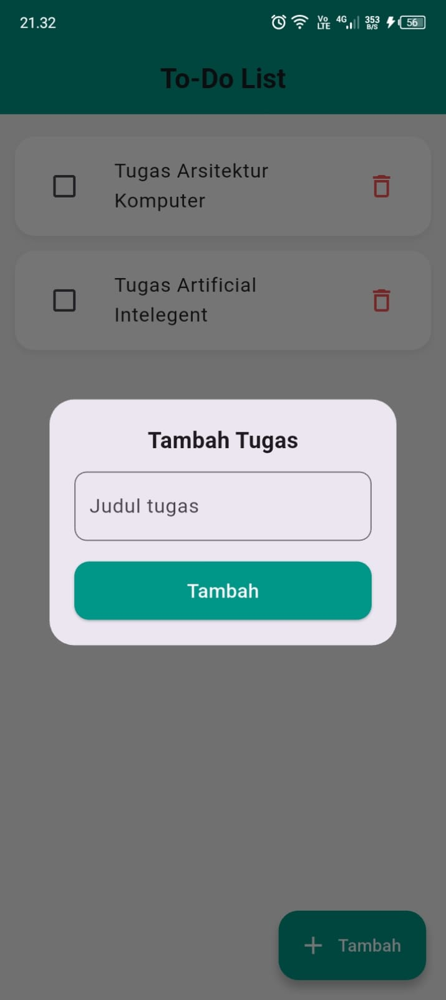

# Simple Stacked MVVM Project

This project is a submission for the Mobile Programming 2 course assignment, focusing on a presentation about Stacked MVVM in Flutter.

## Demo Video

To view the demo of the application, please follow this link: [Demo Video](demo/demo-mvvm-to-do-list.mp4).

## Source Code

The source code for this project can be found in the `source code` directory.

